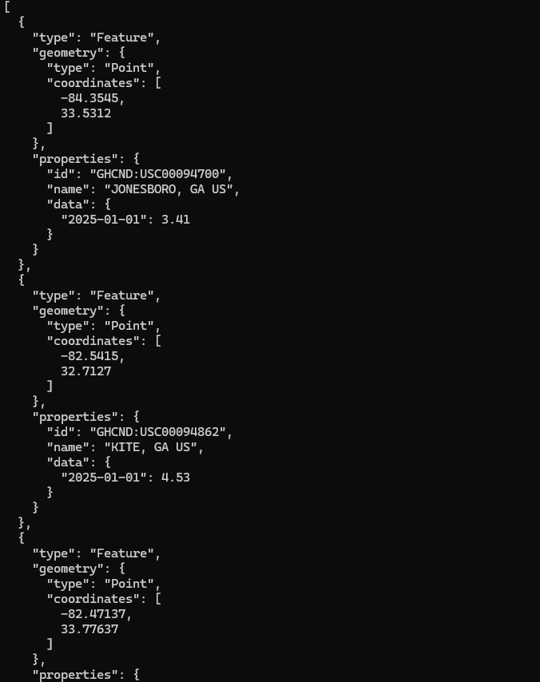
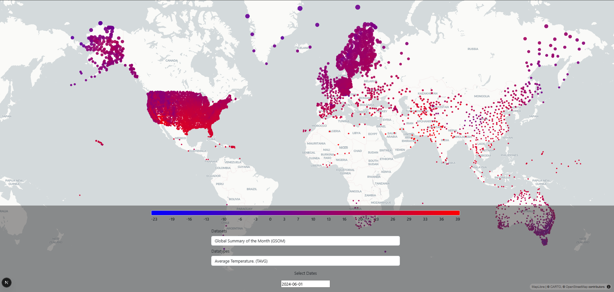

# National Centers For Environmental Information Data Pipeline - End-to-End Project
A full-stack  data pipeline that includes:
- Data Ingestion from Climate data online web service (https://www.ncdc.noaa.gov/cdo-web/webservices/v2#gettingStarted)
- Data preprocessing 
- Database Layer
- Backend Service
- Frontend Interface

Frontend, backend and database run on Docker. So no need to install 

```text
.
├── backend (RestFul backend service in GeoJSON format)
├── data_preprocess (Data processing tools to convert json files to CSV to insert into database)
├── fetch_data (Bash scripts to make requests)
├── frontend-map-app (Frontend for map visualization)
└── migrations (Database migration data and sql and bash scripts)

```

## Data Ingestion
I fetched the data from the base URL https://www.ncei.noaa.gov/cdo-web/api/v2/{endpoint} by using a custom Bash script to download NOAA climate data using multiple API keys in parallel for better speed and rate limit handling.
### 🛠️ Script Overview
1. Fetches climate data (e.g., GSOM) from NOAA’s API
2. Uses multiple API keys in a round-robin fashion to bypass rate limits
3. Splits large requests into paginated segments using offset
4. Runs requests in parallel using GNU parallel
5. Validates and saves only valid JSON responses

```text
fetch_data
├── check_data.sh (Check for the missing offsets)
└── fetch_round_robin.sh (Script to make requests by using many TOKENs alternately)

```
### 📂 Output Structure
```text
└── GSOM/
    └── 2022-04-01_2023-03-31/
        ├── 0.json
        ├── 1000.json
        ├── 2000.json
        └── ...

```

Data is retrieved in batch requests over a one-year time window. Once downloaded, the data is transformed by processing into CV before being inserted into the database. 


## Data Processing 
I wrote a custom Python on Google COLAB (https://colab.research.google.com/drive/1fCd7rRD1-ebMzBYxOT8pdtgKqN29SeP8?usp=drive_link). Preprocessing steps are as follows:

1. Asynchronous JSON Reading
2. Write JSONL (all valid records are written into one .jsonl file)
3. Converting JSONL to DataFrame and remove duplicates. 
4. Data saved in CSV in the same order as the schema 

Data and the notebook can be found in the shared folder (https://drive.google.com/drive/folders/1Cy7npgD27nL5gDY7abR0EjOsXw8w9OGN?usp=sharing)

## Database Design

The processed NOAA data is stored in a PostgreSQL database with PostGIS extension enabled for geospatial operations. The database 


### 📌 Key Fields and Constraints
- Primary Keys:

stations.id is a unique station identifier

station_data uses a composite key on (date, station_id, dataset_name, datatype)
### 🔑 Primary Keys

- **`stations.id`**: Unique station identifier
- **`station_data (date, station_id, dataset_name, datatype)`**: Composite primary key ensuring one value per day per datatype per station

### 🔗 Foreign Key

- **`station_data.station_id` → `stations.id`**
  - Enforced with `ON DELETE CASCADE` to remove station data if the station is deleted

### 🧭 Indexes

- **GIST index** on `stations.geom`  
  For fast spatial queries using PostGIS (e.g., find stations within a radius)
- **B-tree index** on `station_data (date, datatype, dataset_name)`  
  Optimizes filtering by time, variable type, and dataset
### Project Structure for database migrations
``` text
migrations
├── csv
│   ├── station_data
│   │   ├── GSOM_2022-03-30_2023-03-30.csv
│   │   ├── GSOM_2023-03-31_2024-03-31.csv
│   │   └── GSOM_2024-04-01_2025-04-01.csv
│   └── stations
│       └── stations.csv
├── init_sql
│   └── init.sql
├── run_migrations.sh
└── sql
    └── query.sql
  ```
Your database should be ready to run the backend service.
#### How to run the database with Docker

```
docker compose up db -d
```
#### How to migrate data to the database
1- First create the schema and tables.
```
run_migrations.sh init.sql
```
2- You may need to have the CSVs in migrations/, you can download the folder from google drive https://drive.google.com/drive/folders/1IYsmxJI4N-VsF4U1sBR4cnWZ3XZgjVp-?usp=drive_link inside /migrations and unzip the zip file.


3- First insert in stations table 

```
./run_migrations.sh insert_station
```
4- And then all the existing station data 
```
./run_migrations.sh insert_station_data
```
5- Go check the data if needed or any query put in the query.sql file
```
./run_migrations.sh query.sql
```
6- Delete all the csv files copied to the docker container, after having the inserted data.
```
./run_migrations.sh delete_all_csv
```


### Backend 
I created the backend service to serve GeoJSON data, which is a standard format to send the geographic data. 
### Project Structure 
```
backend
├── HELP.md
├── build.gradle
├── gradle
│   └── wrapper
│       ├── gradle-wrapper.jar
│       └── gradle-wrapper.properties
├── gradlew
├── gradlew.bat
├── settings.gradle
└── src
    ├── main
    │   ├── java
    │   │   └── dev
    │   │       └── noaa
    │   │           └── backend
    │   │               ├── BackendApplication.java
    │   │               ├── config
    │   │               │   └── CorsConfig.java
    │   │               ├── controller
    │   │               │   ├── StationController.java
    │   │               │   └── StationDataController.java
    │   │               ├── model
    │   │               │   ├── Station.java
    │   │               │   ├── StationData.java
    │   │               │   └── StationDataId.java
    │   │               ├── repository
    │   │               │   ├── StationDataRepo.java
    │   │               │   └── StationRepo.java
    │   │               ├── service
    │   │               │   ├── StationDataService.java
    │   │               │   └── StationService.java
    │   │               └── util
    │   │                   └── StationGeoJsonSerializer.java
    │   └── resources
    │       ├── application.yaml
    │       ├── static
    │       └── templates
    └── test
        ├── java
        │   └── dev
        │       └── noaa
        │           └── backend
        │               └── BackendApplicationTests.java
        └── resources
            └── application-test.yml
```
You can check the GeoJSON output by querying with the date, data type and dataset name. 
```
curl -X GET "http://localhost:8080/data/exact?date=2025-01-01&datatype=TAVG&datasetName=GSOM" -H "Content-Type: application/json" |jq | head -n 20
```
or on the browser.





#### Technologies Used
- Spring Boot - for building the RestAPI from PostgreSQL with PostGIS
- Gradle - build automation tool

### Prerequisites
- Java 21+
- Gradle 8.12+ 

### How to run with Gradle
First you need to have the database with data migrated and move on to the backend part

1- Start the Spring Boot service without needing to build a .jar file
```
./gradlew bootRun
```

2- Second alternative is to compile and test and package the app and then run -jar file inside build/libs/

```
./gradlew clean build
```
and then 
```
java -jar build/libs/backend-0.0.1-SNAPSHOT.jar
```

### Frontend

This is an interactive geospatial web application built with **Next.js**, **Deck.gl**. It visualizes datasets using customizable color scales, date pickers, and dynamic map layers.
### Features 
- 🗺️ Map rendering with `deck.gl` and `MapLibre`
- 📅 Interactive date range picker
- 🎨 Color bar legends for visual cues
- 📊 Dataset and data type selection with dropdowns
- ⚙️ Built with modern technologies: TypeScript, React 18, and Next.js 15

### Technologies Used
- **Next.js** 15 with App Router
- **TypeScript**
- **Deck.gl** for high-performance map layers
- **MapLibre GL** for map rendering
- **D3.js** for color scaling and data representation
- **React Datepicker**, and other UI libraries

### Project Structure
```
frontend-map-app/
├── Dockerfile
├── README.md
├── eslint.config.mjs
├── next-env.d.ts
├── next.config.ts
├── package-lock.json
├── package.json
├── public
│   ├── datasets_merged.json
│   └── datatypes_merged.json
├── src
│   ├── app
│   │   ├── favicon.ico
│   │   ├── globals.css
│   │   ├── layout.tsx
│   │   ├── page.module.css
│   │   └── page.tsx
│   └── components
│       ├── ColorBar.tsx
│       ├── DateRangePicker.tsx
│       ├── DeckMap.tsx
│       ├── Dropdown.tsx
│       └── MapComponent.tsx
└── tsconfig.json
```
### Installation 
Make sure you have **Node.js 18+** and **npm** installed.

Run in the development mode.
```bash
cd frontend-map-app
npm install
npm run dev
```
Or build for production:
```
npm run build
npm run start
```



## Run With Docker
You can run the whole stack database, backend and frontend 
```
docker compose up -d
```
If you want to start a database 
```
docker compose up db -d
```
If you want to delete whole data in the database 

```
docker compose down -v
```


